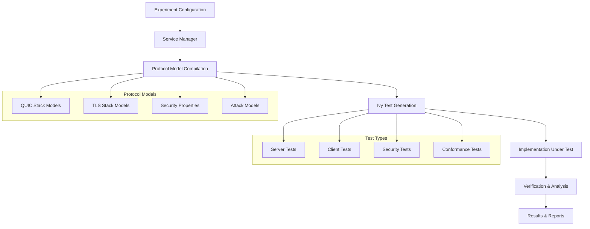

# Panther Ivy Tester

!!! info "Plugin Information"
    **Plugin Type**: Service (Tester)  
    **Source Location**: `plugins/services/testers/panther_ivy/`

!!! warning "Advanced Testing Tool"
    Ivy integration requires formal protocol specifications and is intended for advanced users familiar with formal verification methods. For basic protocol testing, consider using standard IUT plugins first.

IVy is a research tool intended to allow interactive development of
protocols and their proofs of correctness and to provide a platform
for developing and experimenting with automated proof techniques. In particular, IVy provides interactive visualization of automated
proofs, and supports a use model in which the human protocol designer and the automated tool interact to expose errors and prove
correctness.

[](https://doi.org/10.5281/zenodo.10819552)

   


## Requirements and Dependencies

The plugin requires:

- **Ivy**: The Ivy formal verification framework
- **Python**: Python 3.7 or higher
- **Protocol Model**: Formal specification of the protocol in Ivy language
- **Build Tools**: C++ compiler and related development tools

Docker-based deployment installs all necessary dependencies automatically.


**Overview:** Integration with Microsoft's Ivy formal verification tool for protocol verification and specification-based testing. Panther-Ivy provides compositional specification-based testing where formal protocol models generate test traffic and verify implementation compliance.

**Complete Workflow Architecture:**



## Configuration Options

The Panther Ivy Tester accepts the following configuration parameters:

```yaml
services:
  panther_ivy:
    name: "quic_verifier"
    implementation:
      name: "panther_ivy"
      type: "tester"
    protocol:
      name: "quic"
      version: "rfc9000"
      role: "tester"
      target: "quic_implementation"  # Target service name
    config:
      model_file: "quic_model.ivy"  # Formal model
      test_depth: 10                # Exploration depth
      timeout: 600                  # Timeout in seconds
      properties:                   # Properties to verify
        - "connection_establishment"
        - "packet_encryption"
```

| Parameter | Type | Required | Default | Description |
|-----------|------|----------|---------|-------------|
| `name` | string | Yes | - | Service name |
| `config.model_file` | string | Yes | - | Path to Ivy model file |
| `config.test_depth` | integer | No | 5 | Search depth for test generation |
| `config.timeout` | integer | No | 300 | Verification timeout in seconds |
| `config.properties` | array | No | [] | Specific properties to verify |
| `config.build_mode` | string | No | "" | Build mode for compilation (see Build Modes section) |

## Build Modes

PANTHER-Ivy supports multiple build modes for different optimization and debugging needs while preserving backward compatibility with Shadow Network Simulator.

### Available Build Modes

| Build Mode | Description | Use Case | C++ Flags | Z3 Build |
|------------|-------------|----------|-----------|----------|
| `""` (empty) | **Original method** (default) | Shadow Network Simulator compatibility | None (default C++11, shared libz3) | Legacy mk_make.py |
| `debug-asan` | Debug with AddressSanitizer | Memory debugging, development | `-O1 -g -fsanitize=address -fno-omit-frame-pointer -D_GLIBCXX_DEBUG` | CMake Debug + AddressSanitizer |
| `rel-lto` | Release with Link Time Optimization | Performance testing | `-O3 -flto -fuse-linker-plugin -g` | CMake Release + LTO |
| `release-static-pgo` | Release with PGO and static linking | Maximum performance | `-O3 -flto -fuse-linker-plugin -fprofile-use -march=native -static -s` | CMake Release + PGO + static |

### Configuration Examples

**Original Method (Shadow Compatible):**
```yaml
services:
  panther_ivy:
    config:
      build_mode: ""  # or omit entirely
```

**Debug Mode:**
```yaml
services:
  panther_ivy:
    config:
      build_mode: "debug-asan"
```

**High Performance Mode:**
```yaml
services:
  panther_ivy:
    config:
      build_mode: "release-static-pgo"
```

### Environment Variable Override

You can also set the build mode via environment variable:
```bash
export BUILD_MODE="rel-lto"
```

### Shadow Network Simulator Compatibility

The original method (empty `build_mode`) is preserved exactly as before to ensure Shadow Network Simulator continues to work without changes. This uses:
- Plain `make` with default C++11 standard
- Shared `libz3.so` library
- Legacy `mk_make.py` build system
- No additional compilation flags

## Supported Protocols

The Panther Ivy Tester has formal models for the following protocols:

| Protocol | Available Models |
|----------|------------------|
| QUIC | Connection establishment, packet processing, stream management |
| MinIP | Basic protocol operations, error handling |
| HTTP | Request/response validation, header processing |


### QUIC


**Ivy Protocol Models:**

The Panther-Ivy system uses formal Ivy models that define:

```ivy
# Example: QUIC Packet Structure
object packet = {
    object quic_packet = {
        variant this of packet = struct {
            ptype : quic_packet_type,
            pversion : version,
            dst_cid : cid,
            src_cid : cid,
            token : stream_data,
            seq_num : pkt_num,
            payload : quic_frame.arr
        }
    }
}

# Example: Packet Event
action packet_event(src:ip.endpoint, dst:ip.endpoint, pkt:packet.quic_packet) = {}
```

**Protocol Layers Architecture:**

```
┌─────────────────────────────────────┐
│         Application Layer           │  <- quic_application.ivy
├─────────────────────────────────────┤
│         Security Layer              │  <- quic_security.ivy
├─────────────────────────────────────┤
│         Frame Layer                 │  <- quic_frame.ivy
├─────────────────────────────────────┤
│         Packet Layer                │  <- quic_packet.ivy
├─────────────────────────────────────┤
│         Protection Layer            │  <- quic_protection.ivy
├─────────────────────────────────────┤
│         Datagram Layer (UDP)        │  <- Network interface
└─────────────────────────────────────┘
```


**Integration with Implementations:**

The system uses **shim layers** to interface with real protocol implementations:

```ivy
# ivy_quic_shim.ivy - Interface between Ivy model and implementation
implement quic_net.recv(host:endpoint_id, s: quic_net.socket, src:ip.endpoint, pkts:net_prot.arr) {
    if host = endpoint_id.server {       
        call server.behavior(host,s,src,pkts);
    } else if host = endpoint_id.client { 
        call client.behavior(host,s,src,pkts);
    }
}
```

**Test Result Analysis:**

Test outputs include:
- **Trace files**: Detailed execution traces showing packet exchanges
- **Invariant violations**: When protocol properties are violated
- **Counterexamples**: Specific sequences that expose bugs
- **Coverage reports**: Which parts of the protocol were exercised
- **Performance metrics**: Timing and resource usage


**Available Test Categories:**

| Test Category | Purpose | Example Tests |
|---------------|---------|---------------|
| **Server Tests** | Test server-side protocol behavior | `quic_server_test_stream`, `quic_server_test_handshake_done_error` |
| **Client Tests** | Test client-side protocol behavior | `quic_client_test_max`, `quic_client_test_0rtt` |
| **Security Tests** | Test security properties and attack resistance | `quic_attack_replayed_packet`, `quic_attack_forged_packet` |
| **Conformance Tests** | Test RFC compliance | `quic_server_test_version_negociation`, `quic_client_test_retry` |
| **Error Handling** | Test error conditions and recovery | `quic_server_test_token_error`, `quic_server_test_tp_error` |

## Usage Examples

### QUIC Protocol Verification

**Example Test Execution:**

```yaml
# Experiment configuration excerpt
services:
  picoquic_server:
    implementation: 
      name: "picoquic"
      type: "iut"
    protocol: 
      name: "quic"
      role: "server"
      
  ivy_client:
    implementation: 
      name: "panther_ivy"
      type: "testers"
      test: "quic_server_test_stream"
    protocol:
      name: "quic"
      role: "client"
      target: "picoquic_server"
```

This configuration creates a test where:
1. Picoquic runs as a QUIC server
2. Ivy acts as a formal client tester
3. The `quic_server_test_stream` test generates client traffic to test the server's stream handling
4. Results verify server compliance with QUIC specifications


# Installation (*old*)
## Linux
On Debian-based Linux ditributions such as Ubuntu, download and install the file `ms-ivy_X.X_YYYY.deb` where `X.X` is the IVy version and `YYYY` is the machine architecture. Use your system’s package manager to install this package, or the following commands:
```
$ sudo dpkg -i ms-ivy_X.X_YYYY.deb
$ sudo apt-get install -f
```
The first command will report missing dependencies, which will be installed by the second command.

## Windows
The Windows binary distribution is in the form of a zip archive. Download the file `ivy.X.Y-.Windows-z86.zip`, where `X.X` is the IVy version (this will work on both 32-bit and 64 bit Intel Windows). Use Windows Explorer to extract this archive in the directory `C:\`. This should give you a directory `C:\ivy`. To use IVy in a command window, first execute this command:
```
> C:\ivy\scripts\activate
```

## Command Generation

The PantherIvy plugin uses a structured approach to command generation, ensuring proper escaping of special characters and reliable execution:

### Structured Command Arguments

Commands are built as lists of arguments rather than concatenated strings. This allows for proper escaping of each argument:

```python
# Example from generate_run_command
command_args = []
command_args.extend(["seed=", str(params_dict["seed"])])
command_args.extend(["server_addr=", params_dict["server_addr"]])
command_args.extend([">", "/app/logs/testers.log"])
```

### Environment Variables

Environment variables are stored in dictionaries:

```python
env_vars = {
    "IVY_LOG_LEVEL": log_level,
    "TEST_NAME": test_name,
    "PATH": "/usr/local/bin:/usr/bin"
}
```

### Handling Edge Cases

The command generation system correctly handles edge cases such as:

- **Paths with spaces**: `/path with spaces/file.txt`
- **Special characters**: `"Hello & Goodbye"`
- **Redirections**: `command > output.txt 2> error.log`
- **Environment variables with special values**: `KEY=value:with:colon;and;semicolons`

### Template Rendering

Command templates are rendered with proper escaping using Jinja2 filters:

```python
rendered = template.render(
    command_args=command_args,  # List of properly escaped arguments
    env_vars=env_vars,          # Dictionary of environment variables
    extra_fields=extra_fields   # Any additional template-specific values
)
```

### Important Note

Do not modify the template files directly. Instead, customize command generation by changing how data is passed to the templates. This ensures consistent behavior and proper character escaping.
